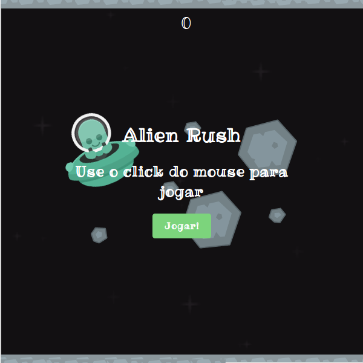

# jogo simples com javascript e html

jogo simples com javascript es6 e html (canvas).

Scrennshot: 

## jogar:
clone ou baixe e extraia o repositorio e abra o index.html

## modificar:

clone ou baixe e extraia o repositorio

#### Usando o Gulp

certifique-se de ter o [nodeJs](https://nodejs.org/en/) e o Npm instalados

intale as dependências de desenvolvimento com o comando: 
> npm install

para comprimir o js e 'transpilar' para es5 a cada mudança no código fonte use o comando 

> gulp

ou para comprimir os scripts apenas uma vez, use o comando: 

> gulp compress-js

para comprimir as imagens do jogo use o comando 

> gulp compress-imgs

#### Sem o Gulp
faça as seguintes alterações no index.html

remova a tag de comentario nos scripts abaixo do comentario: 'scripts de desenvolvimento'

comente o script abaixo do comentario 'script gerado por gulp'
